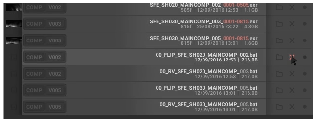

<center>

# ![alt text][logo] Bookmarks

### A simple file and asset manager for animation and CG productions.

  


#### Bookmarks provides an overview of your shots, the files inside them and any custom notes, thumbnails and descriptions you or your team added. You can use Bookmarks to [create new jobs](#getting-started), add assets to them, or [browse existing content](#content-structure).

## Features

Create jobs and assets using custom folder templates
<br>
Annotate items using thumbnails, TODOs, tags and descriptions
<br>
Archive superflous items without touching underlying files
<br>
Preview easily most image formats and Alembic archives
<br>
Reveal files in Finder / Explorer
<br>
Push footage to **Shotgun RV** from within Bookmarks
<br>
[Send file paths and messages directly with **Slack**](#slack)
<br>
[Dedicated Maya plugin](#bookmarks-maya-plugin)

| Adding thumbnails and descriptions is easy... |
| -- |
|  |
|  |

| ...as is archiving items |  |
| -- | -- |


## ![alt text][maya] Bookmarks Maya Plugin

Bookmarks replaces Maya's **_Set Project_** and uses assets to set the current workspace. Use bookmarks to import and export footage, caches and scenes, or to apply the default bookmark _frame rate_, _frame range_ and _resolution_ to the current scene.


> Bookmarks comes with a it's file saver. It can name and version your scenes based on current bookmark, asset and mode selections.
> You can also use it to create named template files when not running Bookmarks from inside a DCC.


## ![alt text][slack] Slack

To send messages using Slack configure your bookmark with a valid Slack OAuth token.

The tokens are generated automatically when you install a new app to your workspace.
[See guides on Slack](mailto:hello@gergely-wootsch.com) on how to add a new app. Make sure to enable the following scopes:

| OAuth Scopes |`channels:read`<br>`chat:write`<br> `chat:write.public`<br>`groups:read`<br>`users:read` |
|--|--|


## Getting Started

`Right-click` anywhere on the main window and select ![alt text][add] `Manage bookmarks`. Use the window to configure servers, create new jobs and bookmark folders.


To add a server, click the ![alt text][add] icon next to "Servers".


``` python
  # The server is usually a location on a central network
  # location but can be any folder accessible to your computer, eg.
  # \\MY-SERVER\JOBS or C:\JOBS /volumes/server/jobs can all be valid.
```

To create a new job, click ![alt text][add] next to _Jobs_.
As templates are simple zip files you can add your own by draggin any zip file where
the templates are listed, or select `right-click` -> `Add template...`</p>

If the job template already has bookmark folders they will be listed below.
Click the bookmark to add or remove it.
To mark a new folder as a bookmark, click ![alt text][add] by the _Bookmarks_ label.


## Content Structure


Content is organised into three separate sections: `Bookmarks`, `Assets` & `Files`.


| Overview  |   |
|---|---|
| Bookmarks | Folders in your job folder and the main container for CG content. Each bookmark has its own _framerate_, _resolution_, _default frame-range_, and _Slack Token_.|
| Assets  | Maya or Houdini workspace-like folder structures. Each contains a series of **task folders** (eg. _scene_, _render_, etc. folders). Any folder can be an asset, and any folder containing an "asset identifier" file (eg. `workspace.mel`) will be recognised as an asset automatically. |
| Files  | Files are stored inside task folders. When browsing, Bookmarks reads all files inside a selected task folder, including files in subdirectories. You can use the provided search and filter tools to locate and save items.  |

``` python
  # Parsing the whole task folder does come with a performance tradeoff as all
  # files have to be loaded in advance. Up to a few hundred thousand files this
  # should not take too long, but a lot depends on network access, hard-drive
  # speeds, etc.
```


## Credits and Acknowledgments

(c) Gergely Wootsch, 2020.
<br>
[Email](mailto:hello@gergely-wootsch.com
)
<br>
[gergely-wootsch.com](http://gergely-wootsch.com)


[logo]: ./bookmarks/rsc/logo_s.png "Bookmarks: A simple file and asset manager for animation and CG productions"
[add]: ./bookmarks/rsc/add_button_s.png "Add button"
[maya]: ./bookmarks/rsc/maya.png "Add button"
[slack]: ./bookmarks/rsc/slack_color_sm.png "Add button"

</center>
